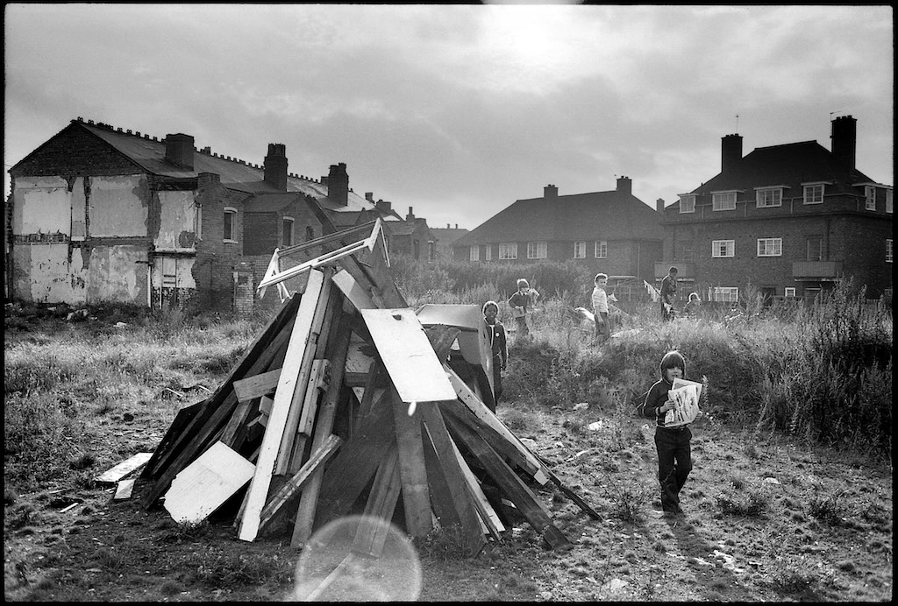
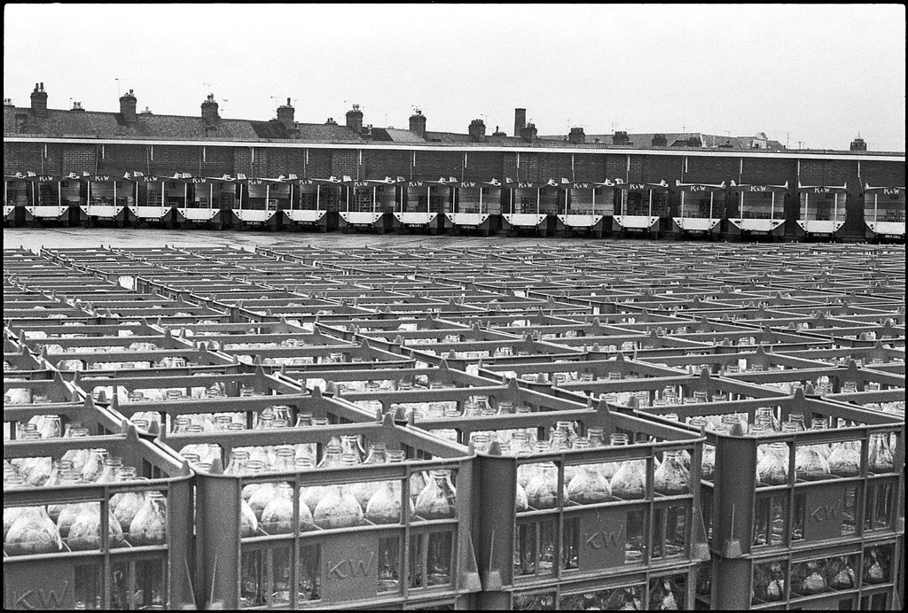
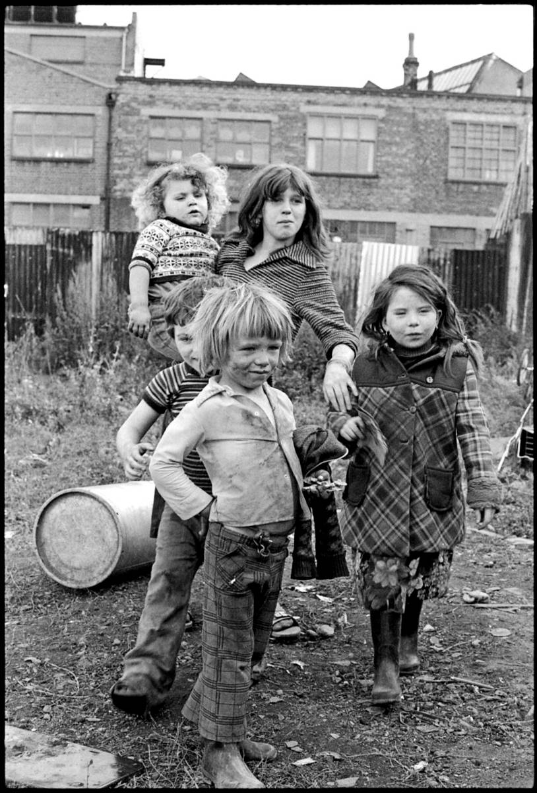
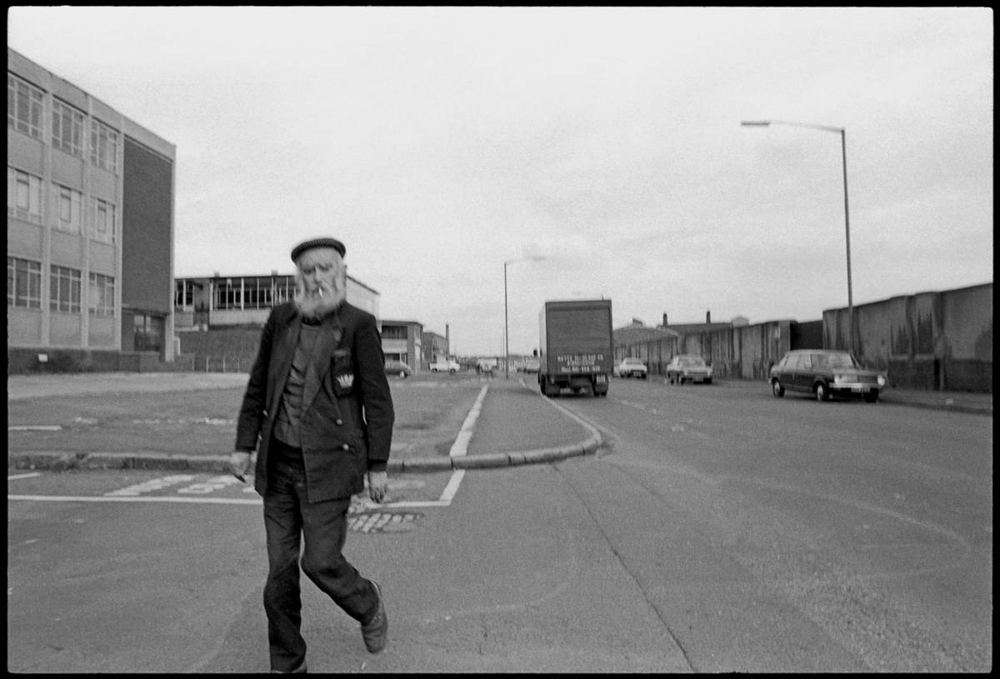
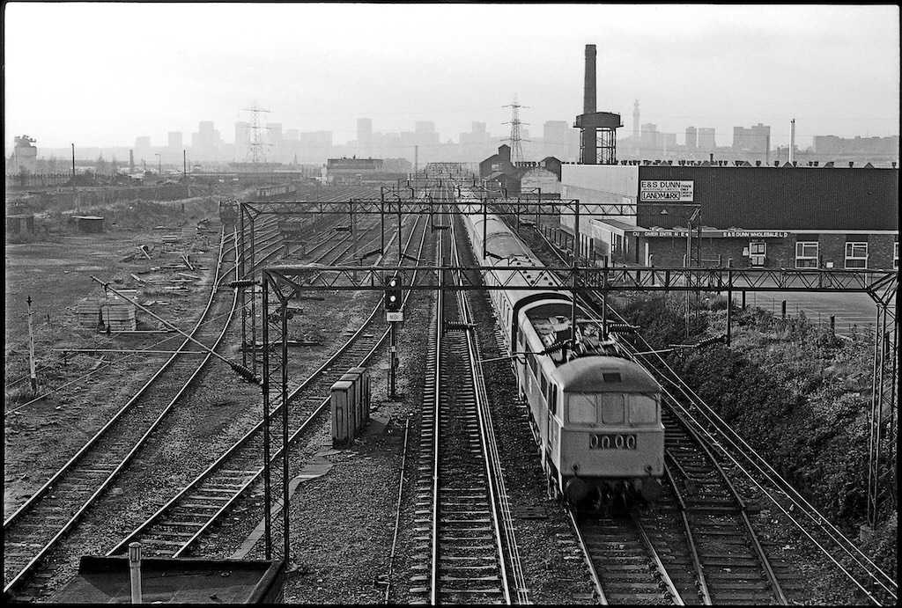
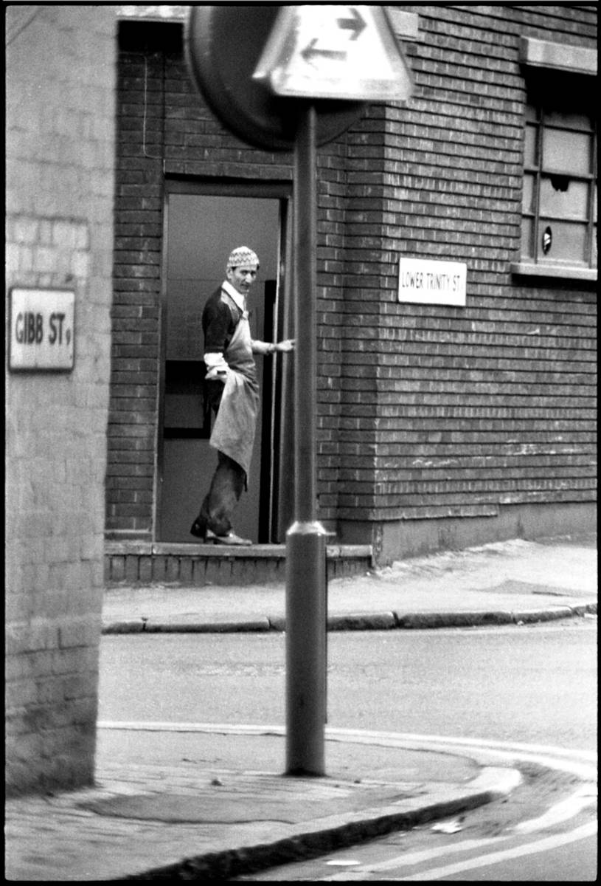
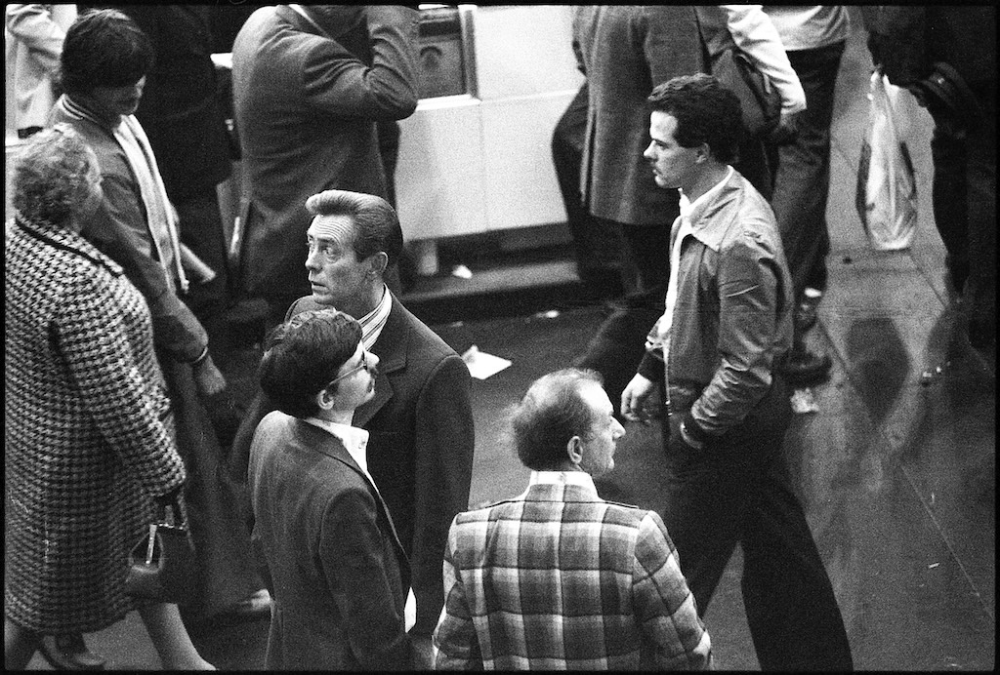
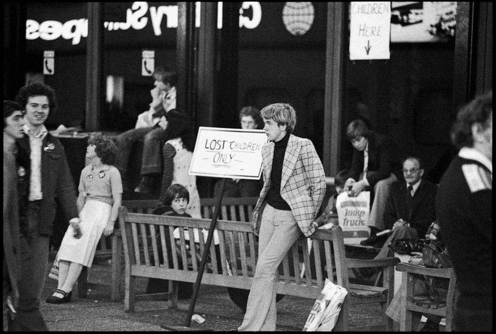
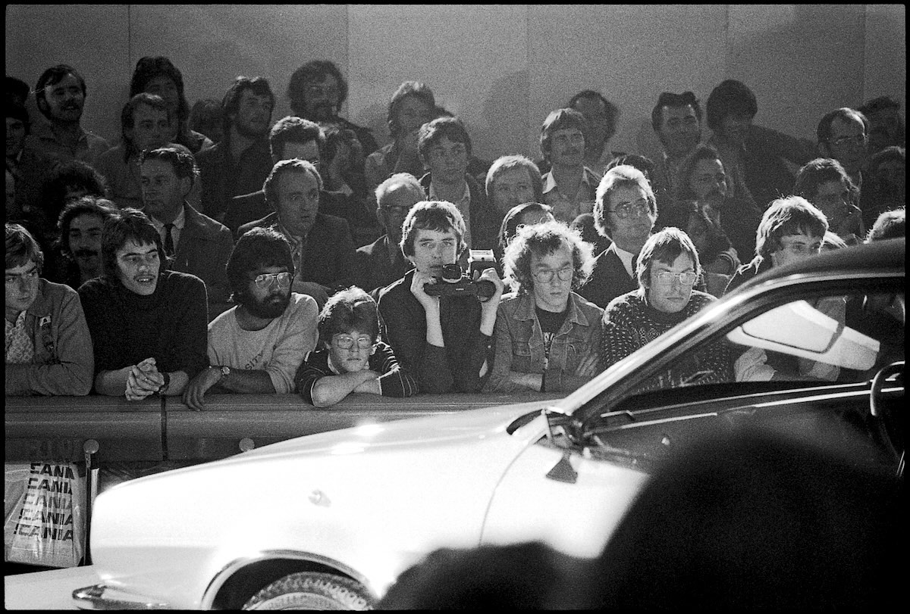

Around 1980, I and a friend came up to Leicester Uni to study engineering, having become friends while at school in Brighton. We were both into photography and fascinated by the industrial landscape we encountered in an around Leicester, so different from what we had known down south. We had many picture taking trips when we should have been doing homework, and it was a productive time photographically. In 1980 we were in a world before ubiquitous photography, and even as 20 year olds with our reasonably priced SLRs we were often taken to be professional photographers, perhaps working for a local newspaper.

*Children make a bonfire out of rubbish at the edge of slum clearance area in Birmingham*

*The K&W dairy milk depot in Leicester, these were the days before we began to get all of our milk from the supermarket*

::: portrait

*Traveller children playing on the fringes of a derelict housing estate*
:::

*A man walking in a run-down industrial area of Birmingham*

*The vast railway lands on the approaches to Birmingham New Street station*

::: portrait

*A man takes a break from fish preparation in the back streets of Leicester*
:::

*A snowstorm in Victoria Park, Leicester*

*A man wonders where to go next at the Motor Show, Birmingham NEC*

*Children waiting to be re-united with their parents at the Motor Show, Birmingham NEC*

*Punters gathering to watch a floor show at the Motor Show, Birmingham NEC*
